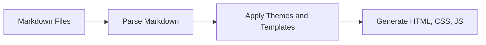

---
date:
  created: 2025-01-14
authors:
  - bruce
categories:
  - Technology
draft: true
---

# Material for MkDocs 
Resources I've used to create this blog using the [Material for MkDocs](https://squidfunk.github.io/mkdocs-material/) static site generator.

<!-- more -->
I adopted [Material for MkDocs](https://squidfunk.github.io/mkdocs-material/) while creating technical documentation sites. It's a Python-based static site generator. Historically, [MkDocs](https://www.mkdocs.org/) was geared towards techical or project documentation sites. [Material for MkDocs](https://squidfunk.github.io/mkdocs-material/) is built on this base project. 

If you aren't familiar with [static site generators](https://en.wikipedia.org/wiki/Static_site_generator), they commonly compile [markdown](https://en.wikipedia.org/wiki/Markdown) into html, css and javascript. They simplify the process of creating web content, but in a different way than [Content Managment Systems](https://en.wikipedia.org/wiki/Content_management_system) do (e.g. Wordpress, Squarespace, Wix, and Ghost). 

Static Site Generator Workflow

I also evaluated [Jekyll](https://jekyllrb.com/) and [Hugo](https://gohugo.io/), which are other static site generators (Ruby and Golang based). Regardless of the option you choose, I find that getting information down in [markdown](https://en.wikipedia.org/wiki/Markdown) makes for a high-speed, low-drag experience. 

The github project [squidfunk/mkdocs-material](https://github.com/squidfunk/mkdocs-material) has over 21.7k :star:

More recently, the author (squidfunk) added a [blog feature](https://squidfunk.github.io/mkdocs-material/plugins/blog/), which is now included in the open source offering. This site uses the blog feature, the source code for this site is located at :material-github: [brucee63/mkdocs-blog](https://github.com/brucee63/mkdocs-blog). The project also has an [Insiders program](https://squidfunk.github.io/mkdocs-material/insiders/) with access to newer and additional features for those that sponsor the project.  

## Getting Started
To work with Material theme for MkDocs, your options are using docker or using Python and pip installed on your laptop or workstation.

## References
[Material for MkDocs](https://squidfunk.github.io/mkdocs-material/)

:material-github: [squidfunk/mkdocs-material](https://github.com/squidfunk/mkdocs-material)

:material-github: [brucee63/mkdocs-blog](https://github.com/brucee63/mkdocs-blog)

:material-youtube:{ .youtube } [James Willet: How to Build and Deploy a Stunning Blog for FREE using Material for MkDocs](https://www.youtube.com/watch?v=pPEUhfTZswc&t=977s)

:material-youtube:{ .youtube } [James Willet: How to Create STUNNING Code Documentation With MkDocs Material Theme](https://www.youtube.com/watch?v=Q-YA_dA8C20)

:material-youtube:{ .youtube } [Ken Harris: Step-by-Step Guide To Making An MkDocs Material Website](https://www.youtube.com/watch?v=NY7DHvo1XVM&
pp=ygUUbWF0ZXJpYWwgZm9yIG1rZG9jcyA%3D)

